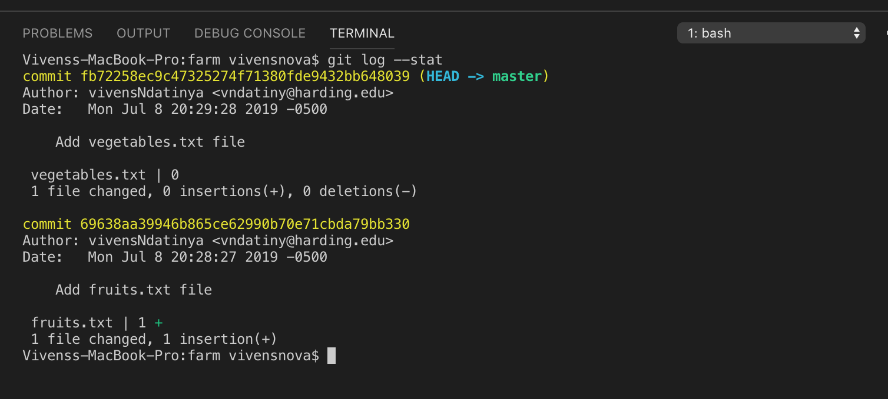

# Git Basic Concepts - 3 Conceptual Areas
Git is version control system that allows to record and manage file changes over time for your project; in other words Git takes snapshots of files and stores that information for you; as a result you can work on separate versions of a file in parallel, you can restore an earlier verison of a file, you can view the history of the changes on your project... With these capabilities it is imperative that a proficient developer masters Git in order to increase her productivity.
At first glance Git might seem to be a very complex system with lots of commands to cram in. The wrong  way to learn Git is to memorize commands without taking the time to understand the fundamentals of Git and its big picture. For my first few months of using Git, I was in the same situation, but when I stepped back and invested time in learning the basic core concepts of Git and how it works, I was really suprised by its simplicity. I realized that commands are just mere tools; once you know what you are doing, it is easier to  recall the right tool for the operation. That is why I decided to share my lessons on Git in this brief post.

Although Git a Distributed version control system, nearly every operation is local. Unlike most of VCS's, Git has the entire history of the project/repository on the local machine, which makes Git operations fast and instantaneous without network latency. For example, to see the repository's history Git simply gets it directly from the repo's local database without needing to fetch it from the server. Also if you want to see the changes between the current version of a file and the earlier one a month ago, Git can quickly look up the version of the file a month ago on your disk, then perform a fast difference calculation. Understanding how Git works locally is the key to master it. Once you understand Git's local operations, it is much easier to grasp its distributed aspects.

First, assuming you already have git installed (you can find installation and setup documentation [here](https://git-scm.com/book/en/v2/Getting-Started-Installing-Git), it is important that you configure your Git `username` and `email`. when you make a commit, Git includes your `username`, `email` and `timestamp` in the history; this configuration helps track when changes were made and by who. You do this congiguration with `git config --global`.
```bash
git config --global user.name "Vivens Ndatinya"
git config --global user.email "vivens@mail.com"
``` 
Global config will be used for all the Git repos on your machine, it is a one-time configuration. The `--local` option instead `--global` can be used if you ever want to set configuration just for one specific repository. Once you have completed the configuration, you can view it by running `git config --list`

Of course a Git repository must exist before you start doing Git operations.  
To create a new Git repository on your machine, you run the `git init` command.  This command creates an empty Git repository (a `.git` directory with the objects and template files for tracking changes). An initial HEAD file that references the HEAD of the `master branch` is also created.  I will discusse the details of Git branches in a later post; For now we will work on the `master branch` automatically created by `Git init`

Now your Git repo is ready. Based on the nature of your project you might want some files not to be part of your project's history; these might be build, log files ... Happily, for this purpose Git supports a special file called `gitignore` which specifies intentionally untracked files to ignore. When decicing what files or directories to ignore Git checks the patterns specified by `gitignore`. These are a couple of the patterns:
* Wild cards can be used to ignore a category of files (eg: `*.debug` ignores all the files ending with .debug)
* An entire directory can be ignored (eg: `logs/` ignores all the files and subdirectories under the `log` directory)
* To learn more on `gitignore` and the patterns you can visit https://git-scm.com/docs/gitignore or https://gitignore.io/

Now Let's focus on the business of this post: Git's basics and local operations:
Git has 3 conceptual areas or states WORKING DIRECTORY, STAGING AREA and HISTORY.
1. **WORKING DIRECTORY**
    * Once the repository is created with `git init`, you are in the WORKING DIRECTORY. The working Directory corresponds to what you see in the file system; it is in the Working Directory state that you add, modify and delete files. 
    * Let's create a project called `farm`, and on the command line we run `git init` to initialize the repository. Next, we add  a file called `fruits.txt` containing `apples` to the `farm` project.  At this point running `git status` shows the state of the working dictory, `fruits.txt` is listed under untracted files.
    
    The next step in the process is to stage the change (move it to the Staging Area)

2. **STAGING AREA**
    * By definition, the staging area is simply a cache of files you want to go into your next commit, which sometimes referred to as the INDEX.
    You might wonder: Is this exrtra step important? Suppose you're working on two features, one of the features is finished, and  the other still needs some work to be done; and before you clock out for the day and go home you would like to make a commit,  but you would not want to commit the parts of the second feature, which is in progress not done yet. In this situation Git becomes your best friend, you stage the changes you know belong to feature #1 and commit them. Feature #1 is done while the changes for feature #2 are still in progress in your working directory waiting for you in the morning... Metaphorically the Staging Area is the reception desk at the library, you put the files there for the librarian to prepare for filing into the library.

    * Changes are staged from the working directory with the `git add` command. `git add .` adds all the working directory's new files and modifications; but you can also selectively stage just specific changes you want to be part of your next commit, which adds only those changes to the staging area. Eg: `git add fruits.txt` will specify stage the new `fruits.txt`. At point running `git status` shows that the changes have been staged.

    

    What's next? Committing to the repo's history

3. **HISTORY**
    * History means that a permanent snapshot of your changes has been created in the Git database. Changes are moved from the staging Area to History with the `git commit` command. When committing the `-m` option allows to add a message for the change; if you don't provide the `-m` option, Git will open your default text editor so that you can enter a detailed even multi-lined message.
    * After committing the changes, the 3 states are in sync, running `git status` will give you `clean`
    * Normally you commit when you want to save the state of your project's files at a particular point time, the best practice is that a commit should be meaningful representing a logical unit of work with some purpose.
    * The `Commit graph`  consists of the history of commits, all the snapshots of the project over time
        * To have more than one commit in our `farm` project, let add a new file `vegetables.txt`, stage and commit it.
        * You can view the history with the `git log` command.

            
        * Importantly you can see only the commits that affected a parcular file with `git log -- filename`

            

        * See the difference between the last commit of a single file with the command
            `git log -p -1 filename` 
            
        * `git log` has several useful options, below are some of them
            * `--graph`: draws a text-based graphical representation of the commit history on the left hand side of the output. `--graph` gives you that visual representation but in the terminal. While it might not look as slick as some Git GUIs, it does have the benefit of being consistently viewed anywhere and much more configurable to your specific needs.
                
            * `--no-decorate`, `--decorate[=short|full|no]`: Prints out the ref names of any commits that are shown. If `short` is specified, the ref name prefixes, refs/heads/, refs/tags/ and refs/remotes/ will not be printed. If `--full` is specified, the full ref name will be printed, the  default option is short. You might want more information than that, though, like which branch was that commit on? Where are the tags? The `--decorate` flag provides this.
                
                
                
                
                
            * `--oneline`:  shorthand for `--pretty=oneline --abbrev-commit` used together. Most of the time you don't care about the author or the date in order to see more commits per screen. `--oneline` prints  only show the commit id and comment per commit.

            

            * `--stat` gives useful information about what changed:  the number of lines that were changed, with insertions represented by a `+` sign, and deletions by a `-`. There is no concept of a `change` to a line as such, the old line is deleted and then the new one added even if only one character changed.

                
            * `--simplify-by-decoration`: Commits that are referred by some branch or tag are selected.
                If you are looking at the whole history of a project and just want to get a feel for its shape before diving in, you may want to see only the significant points of change 
                These remove any commit that was not tagged or branched.

                

            * `git log grep` looks for commits that have specified strings in their commit log messages.
                For example `git log --grep=apple --grep=carrot` finds the commits that mentioned either "apple" or "carrot" in their commit log messages.  Like the usual grep command `git grep`, given more than one patterns means "this or that".
                
                Two options, "--author=name" and "--committer=name" are also supported internally with the same "grep" mechanism.  You can ask: `git log --grep=fruit --author=Vivens`

        * For more options for `git log` refer to https://git-scm.com/docs/git-log

Once you understand these **3 conceptual areas** and how changes move from one state to the next, you can easily grasp some other essential Git operations that you will often need as part of your development workflow
## View and comparing changes

1. First, Git allows comparing  differences beetween the `Working Directory` and `Staging Area`. This is accomplished by running the `git diff` command
    *  In the `farm` project, let add `mango` to the `fruits.txt` file
        * `git status` shows that the file has been changed, by running `git diff` we see the details of the change
            
2. Second, Git allows comparing changes betweeen the `Staging Area` and `History`. This is accomplished by the `git diff --staged` command.  Note the `--staged` option
 * In our farm project, let's stage the `fruits.txt` change: `git add fruits.txt`
    * Running `git diff --staged` shows the difference between staging and the last commit's of history
       

## Undoing Changes


Developers often need to undo changes and restore to an earlier version of a file. Git solves the problem of stressing about losing earlier changes; you can freely experiement with different solutions, design patterns before choosing what is best for the problem at hand. Again Git is the friend that offers the freedom to restore previous changes whenever you need to. 

1. First, we can undo a `Working Directory` change with what is in the `Staging Area`
    * `git checkout -- filename` replaces a file in the `Working Area` with the staged version of the file.
    *  To the `farm` project, let's  make a change to the `vegetables.txt` by adding `carrots`
        * `git status` confirms the change was made
        * We no longer want `cabbage`, we run `git checkout -- vegetables.txt`
            * Are you sure the change is discared? `git status` and `git diff` are your go to detectives!
           
    * Note: In the Working Directory You can only undo changes of the files that were previously staged
    
2. Second, we can undo a change in `Staging Area` with what is in `History` 
    * We override a staged change with what is in the last commit (HEAD) by running the command `git reset HEAD filename`
    * For the`farm` project, we decide to add `asparagus` to `vegetables.txt` and we've already staged it. Oh! we realize we don't have the seeds to plant it and it must be removed.
        * Running the command `git reset HEAD vegetables.txt`

        * If we run `git diff --staged` no difference
        * However the Working Directory still has `aspargus` in `vegetables.txt`; we can confirm this by running `git diff`

            

            * To have a clean Working Directory, we must run `git checkout -- vegetables.txt`.  Now the 3 areas, Working Directory, Staging Area and History are in sync
  
    * Note: You can only unstage from history the changes for the files that have been previously committed.
3. Further: We can restore a file from a specific earlier commit. It is accomplished with `git checkout <commit hash> -- filename`
    * Back to `farm` project, let's add `peach` to `fruits.txt`
    * Now the Working Directory has been changed, let's see the commits that have affected the `fruits.txt`
        * `git log -- fruits.txt`
            * we see and copy the hash for the first commit
        * `git checkout <SHA 1> -- fruits.txt`. This updates both the working directory and the staging area
            *  When in doubt `git status` is your best friend, always use it.
            
## Conclusion
We discussed why understanding the 3 conceptual areas or states of of Git, `Working Directory`, `Staging Area` & `History`, is the key to mastering the invaluable versionc control system.
Based on this knowledge, you can grasp how to perform different Git Operations including viewing changes, comparing differences between the conceptual areas and undoing changes. Remember that Git commands are just mere tools; in whatever Git workflow if you understand the basic conceptual areas, you will know what you are doing and confidently choose the right comand.   No worries, Hakuna Matata. 
